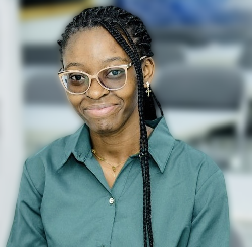

:::::::: {.profile}

::::::: {.profile-side}

::: {.profile-photo}
{fig-alt="Portrait of Brenda Anague"}
:::

<h1 class="profile-name">Brenda Anague</h1>

::: {.profile-role}

:::

::: {.profile-affil}

:::

::: {.profile-links}
- [<i class="bi bi-envelope"></i>Email](mailto:banague@aimsric.org)
- [<i class="bi bi-google"></i>Google Scholar](https://scholar.google.com/citations?hl=en&user=mZlvOeMAAAAJ)
- [<i class="bi bi-person-badge"></i>ORCID](https://orcid.org/0009-0009-9476-950X)
- [<i class="bi bi-card-text"></i>CV](contact.html)
:::

:::::::

::::::: {.profile-main .flow}

## About

I am currently a PhD student in Applied Mathematics in the [Discipline of Mathemtics](https://agriculture-science.ukzn.ac.za/discipline/mathematics/) 
of the [School of Agriculture and Science](https://agriculture-science.ukzn.ac.za/)  
at the [University of KwaZulu Natal ](https://ukzn.ac.za/). My research is funded by DeepMind Technologies Limited through the African Institute for Mathematical Sciences Research and Innovation Centre (AIMS RIC) in Rwanda.

From 2019 to 2021, I hold my first Master's degree in Applied Mathematics from the University of Dschang (Cameroon), 
and from September 2021 to June 2022, I completed a second Master's degree in Mathematical Sciences through a Scolarship 
 at the [African Institute for Mathematical Science Cameroon](https://aims-cameroon.org/). 

My current research work combines  partial differential equations, inverse problems, numerical analysis and  and scientific computing. 
with a particular focus on builing robust computational methods for solving source inversion
problems of PDEs using Physis-informed Neural Networks (PINNs), as well as their theoretical
convergence analysis in approximating PDE solutions.

   

:::::::

::::::::

::::: {.sections .flow}

## Research interests

::: {.chips}
- Partial Differential Equations 
- Inverse Problems 
- Scientific Computing
- Numerical Analysis of PDEs
- Convergence analysis of PINNs 
- Gaussian Processes for Solving PDEs
:::

## Current Research Focus

:::: {.focus}

::: {.focus-item}
### Inverse problems with Physics-Informed Neural Networks

My research investigates on how to develop robust data-driven methods such as Physics-informed Neural Networks for source and parameter estimation in parabolic PDEs, including adaptive training strategies such as the Neural Tangent Kernel. 
In addition, I also estimate the approximation error bound of PINNs in solving source inversion problems from conditional
stability based on Carlemann estimate.
:::

::: {.focus-item}
### Discovering governing equations and initial condition of parabolic PDEs from sparse and noisy data

I develop data-driven approaches that combine Sparse Identification of Nonlinear Dynamics (SINDy) with PINNs, 
to discover governing equations recover and the associated initial conditions from sparse and noisy
 observations of solutions of parabolic PDEs. 
:::

::: {.focus-item}
### Convergence analysis of PINNs in parabolic PDE

I study the convergence rates of PINNs in approximating parabolic PDEs under spectral Barron space regularity assumptions.
:::

::::

## Publications and Preprints

::: {.pub}
[2025]{.tl-year}
[Physics-Informed Neural Networks for Joint Source and Parameter Estimation in Advection–Diffusion Equations]{.tl-title} [arXiv](https://arxiv.org/abs/2512.07755)

:::

## Contact

::: {.contact}
- [AIMS RIC]{.c-label}[banague@aimsric.org](mailto:banague@aimsric.org)
- [UKZN student]{.c-label}[224193340@stu.ukzn.ac.za](mailto:224193340@stu.ukzn.ac.za)
- [AIMS Cameroon]{.c-label}[brenda.anague@aims-cameroon.org](mailto:brenda.anague@aims-cameroon.org)
:::

:::::
